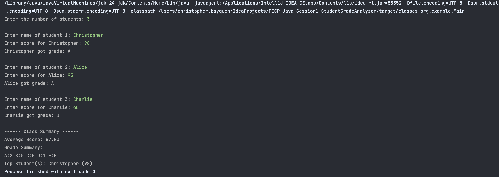
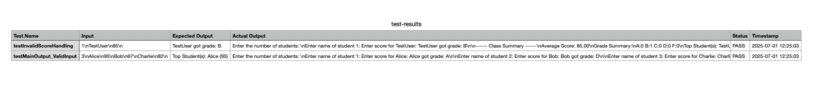

# Mini Capstone: Student Grade Analyzer

Submitted by: Christopher Bayquen | July 1, 2025

This repository holds our submission for our first asynchronous task for our Java Fundamental Sessions. For this activity we were tasked to accomplish a Mini Capstone project that analyzes students' grades and calculates the class average from user inputs. A final summary of the class performance is then provided in the end of the program. 

### Input/Output :

### Output Validation Cases:
